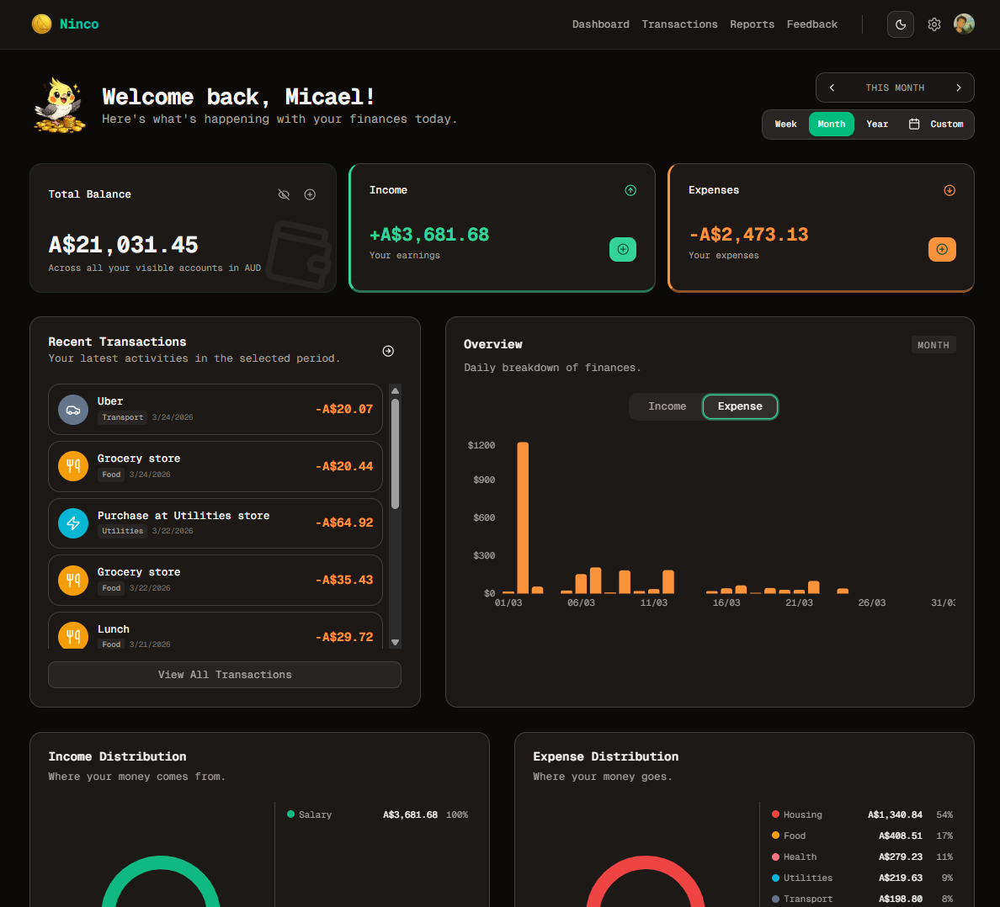

  
  <h1>Ninco</h1>
  
<strong>Stop wondering where your money went..</strong>

  

    <em>Track your spending, stay on budget, and finally feel in control — without the spreadsheet headaches or bloated finance apps. Setup takes 2 minutes.</em>
  

  
  
  
  
  

---

## 🌟 Overview

**Ninco** is a modern, fast, and simple financial management application tailored for individuals who want complete control over their finances without the clutter. Designed as a seamless SaaS product, it provides an intuitive dashboard to track income, expenses, and account balances accurately. 

No more chaotic spreadsheets or complex bloated interfaces. Just a unified, automated, and secure way to keep you on budget.

## 🚀 Key Features

- ⚡ **Track your money without the effort**: Log transactions in seconds. Categorize your spending automatically and see exactly where your money goes every month.
- 📊 **Spot spending patterns easily**: Understand your money through beautiful, interactive charts. Spot trends before they become problems.
- 🏦 **All your accounts, one clear picture**: Manage multiple bank accounts from a single, unified dashboard. Keep track of everything in one place.
- 🤖 **AI Chat Transactions**: Register incomes and expenses through a super fast, simple, and intuitive AI chat interface.
- 💸 **Advanced Transaction Management**: Advanced filtering (by date, type, account, and category) with data exporting directly to PDF, CSV, or JSON.
- 📈 **Comprehensive Report Generation**: Instantly generate detailed, beautifully formatted visual reports of your financial periods for deep personal insights or external sharing.
- 🎨 **Premium UI/UX**: Native Dark Mode support, fully responsive mobile-first design, and interactive components.

## 🛠 Engineering & Architecture

Behind Ninco's simple and intuitive facade lies a rigorously architected, high-performance system. The platform was built with strict engineering standards to ensure scalability, type-safety, and an uncompromised user experience.

### System Architecture
- **Monorepo Pattern**: Engineered using `pnpm workspaces` to seamlessly share types, utility libraries, and configurations between the frontend and backend. This infrastructure ensures strict API contract adherence and eliminates out-of-sync type errors across boundaries.
- **Frontend Architecture**: Built on **Next.js 16** (App Router) employing React Server Components (RSC) to minimize client bundle sizes. It relies on **TanStack Query v5** for precise server-state synchronization, heavy caching, and seamless optimistic UI updates.
- **Backend Services**: A high-throughput, low-latency API layer built on top of **Fastify**. It utilizes robust schema-driven validation using **Zod** at the REST boundary, guaranteeing absolute payload integrity before data enters the application logic tier.
- **Data Persistence**: Backed by a relational **PostgreSQL** database and strictly governed by **Prisma 7** ORM. The database schema relies on optimal indexing strategies, automated rigorous migrations, and uncompromising referential integrity.

### Engineering Methodologies & Best Practices
- **End-to-End Type Safety**: Composed in 100% strict **TypeScript**. The application eliminates type guesswork by propagating generated Prisma models and strict API response interfaces directly to the Next.js frontend via shared workspace packages.
- **Component-Driven UI**: The UI layer enforces atomic, highly modular components managed via **Tailwind CSS 4** and **Shadcn UI**. Custom design tokens strictly enforce standard spacing, dark mode semantic palettes, and WCAG AA accessibility requirements.
- **Complex State & Forms**: Data ingest is handled tightly with **React Hook Form** injected with `zodResolver`, establishing a double-validation paradigm (client and server) without sacrificing performance or reactivity.
- **Security Posture**: Employs a zero-trust authentication model integrated via **Clerk**. Secure sessions, robust edge middleware authentication, and environment-isolated variables protect application bounds.
- **Continuous Integration/Deployment**: Governed by automated GitHub Actions that strictly enforce ESLint rules, TypeScript compilation checks, and comprehensive containerized builds (Docker) to guarantee that every deployment artifact is robust, predictable, and production-ready.

---

  
Built by someone tired of not knowing where their money went.

  
Crafted with ❤️ for better financial clarity.

